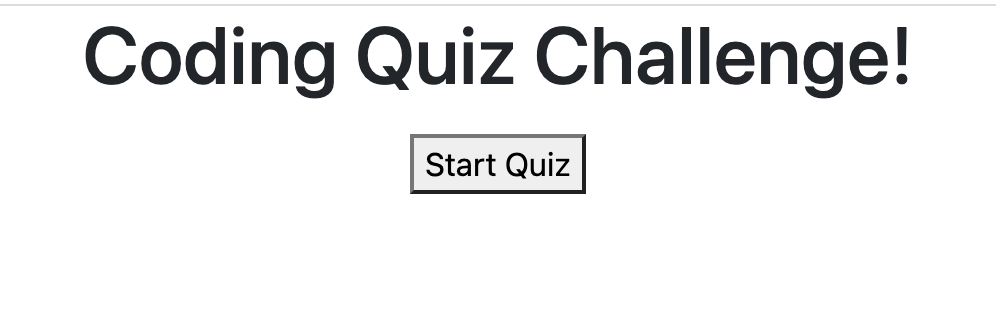
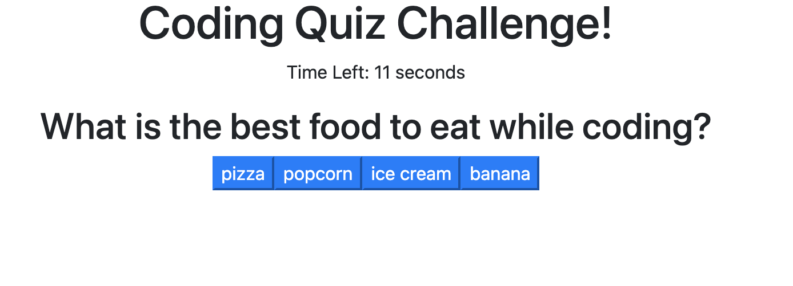
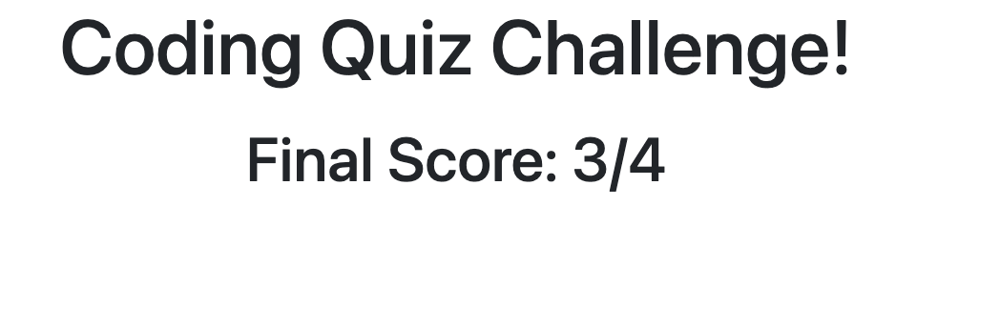

# javascript-quiz
JavaScript Quiz - NU Coding Bootcamp

# password-generator
NU Coding Bootcamp Homework: JavaScript Quiz

<h1>Contents</h1>
<ol>
<li><a href="#repository">The Repository</a></li>
<li><a href="#javascript-quiz">JavaScript Quiz</a></li>
</ol>

<h1 id="repository">The Repository</h1>
The <code>javascript-quiz-1</code> repository contains HTML, CSS & JavaScript files for a quiz that runs using javascript.
<h1 id="javascript-quiz">JavaScript Quiz</h1>
My random password generator can be found here: <a href="https://emilyalv.github.io/javascript-quiz-1/.">https://emilyalv.github.io/javascript-quiz-1/.</a>

The Javascript Quiz includes storing questions, answer choies, and the correct answers in objects and looping through those objects to display each question and its respective answer choices. The user's choice is then compared with the correct answer to determine the user's score. The quiz is timed, and ends automatically if the timer runs out. 

